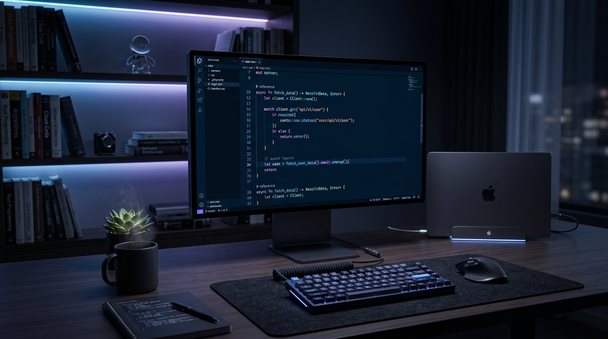

  
    

  <video src="https://github.com/dariocano020/dariocano020/raw/main/memoji.mp4" autoplay loop muted playsinline width="180"></video>

  <h1>¡Hola! Soy Darío Caño </h1>
  <h3>Estudiante de DAW | Desarrollador Full Stack | Ecosistema Apple</h3>

 

  <h2>Sobre Mí</h2>

Soy un estudiante de 2º año en el **Grado Superior de Desarrollo de Aplicaciones Web (DAW)** en el **IES FERNANDO III** (Martos, España). Me apasiona el código limpio, la arquitectura estructurada y mantener un control total sobre mis herramientas de trabajo.

- 🍏 **Entorno:** Disfruto combinando el poder y libertad de **Linux** con la estética y fluidez del ecosistema **Apple**.
- 🚀 **Objetivo:** Convertirme en un desarrollador **Full Stack** capaz de construir productos de principio a fin.
- 🎬 **Pasiones:** Además de la programación, me encanta mantenerme activo con el deporte y soy un gran aficionado a la **edición de vídeo**.

 

  <h2>Stack Tecnológico</h2>

  

 

  <h2>¡Conectemos!</h2>

  
  
  

  

